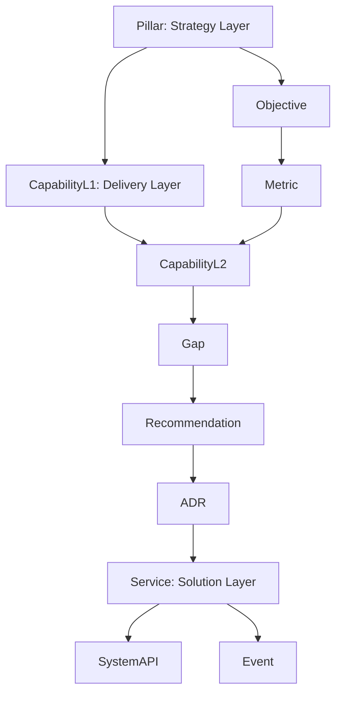

# Copilot Instructions: Documentation & Knowledge Management

Authoritative guide for using Copilot to produce high-quality, human-first documentation and maintain cross-conversation knowledge.

---
## 0. Core Principles

**Purpose & Scope:**
This guide covers documentation standards (sections 1-9) and mandatory knowledge management practices (section 10) for maintaining high-quality, human-first content and cross-conversation memory in the Yorizon program.

**Always Do**
- Follow section 10 MCP Memory & Knowledge Graph practices when MCP memory is available.

**Output Quality:**
- Human-first (clear, direct, actionable)
- Technology-agnostic unless specificity adds value
- Modular, navigable, internally cross-linked
- Safe (no secrets, PII, or proprietary leakage)

**Documentation Standards:**
- Plain, concise language; define jargon on first use
- Rationale mandatory for Decisions & Patterns (include rejected alternatives)
- Use imperative for instructions, present tense for descriptions
- Prefer pseudocode or neutral examples; show architecture principles
- Maintain glossary governance and version history
- Use Mermaid diagrams for visual clarity

**Assistant Behavior:**
- Search before creating (avoid duplication in docs and knowledge graph)
- Justify each new entity (why needed, uniqueness)
- Request missing rationale if Decision lacks trade-offs
- Encourage consolidation when similarity detected
- Avoid speculative or overly granular entities

**Knowledge Management:**
- **MCP Memory & .knowledge folder** (if available): Persist durable knowledge across sessions following `.knowledge/solution/taxonomy/knowledge-graph-schema.md` (canonical schema for node types, relations, naming conventions). Start sessions with "Remembering..." + `read_graph`. Create schema-compliant entities with precise relations. See section 10 for details.

---
## 1. Documentation Mapping

Each knowledge artifact should map to appropriate documentation:
- Concepts/Patterns/Practices: Dedicated markdown page (single topic per file)
- Decisions: ADR file with context, options, rationale, consequences
- Terms: Central glossary section
- Risks: Include likelihood, impact, mitigation references
- ActionItems: Sync with task system

Maintain an index file summarizing entities with links for discoverability.

---
## 2. Writing Standards

- Plain, concise language; define jargon on first use
- Bullet lists for structured data; short paragraphs
- Rationale mandatory for Decisions & Patterns (include rejected alternatives briefly)
- Use imperative for instructions, present tense for descriptions
- Prefer pseudocode or neutral examples; show architecture principles (modular, isolated interfaces)

---
## 3. Glossary Governance

- One canonical Term per concept
- Template fields: definition, scope, misconceptions, related terms
- Use alias-of for synonyms (never duplicate definitions)
- Quarterly review: merge obsolete or overlapping terms

---
## 4. Evolution & Versioning

- Supersede instead of overwrite for Decisions
- Mark deprecated entities with status=deprecated + observation explaining reason
- Keep historical chain for auditability
- Use observations for incremental adjustments (never silently edit original summary)

---
## 5. Privacy & Redaction

- No secrets, credentials, PII, or undisclosable details
- Abstract vendor-specific or sensitive names where possible
- If redaction needed: delete mistaken entity, add observation to related safe entity summarizing redaction rationale

---
## 6. Diagrams & Visuals

- Use Mermaid; embed with ```mermaid fences
- Node IDs: alphanumeric + underscores only (no special punctuation or hyphens)
- Provide flowchart + optional sequence for complex interactions

Example (Knowledge Graph Structure):


---
## 7. README Template

1. Context & Objectives
2. High-Level Architecture (Flowchart + Sequence)
3. Core Concepts & Patterns
4. Features / Capabilities
5. Dependencies / Constraints
6. Operational Practices / Runbooks / SLOs
7. Decisions (links to ADRs)
8. Glossary (local additions referencing global)
9. Risks & Mitigations
10. See Also

---
## 8. Maintenance Cadence

- Weekly: Triage new Questions, Risks, ActionItems
- Biweekly: Merge overlapping Concepts/Terms
- Monthly: Review deprecated items; confirm supersession chains
- Quarterly: Audit clarity/connectivity; raise refactor proposals

---
## 9. Anti-Patterns

- Near-duplicate Concepts differing only in adjectives
- Generic relates-to spam
- Storing large code/log content (link externally)
- Multi-topic entities (split instead)
- Deleting without supersedes path
- Creating entities for ephemeral meeting notes

---
## 10. MCP Memory & Knowledge Graph (When Available)

When MCP memory is available, capture durable knowledge across sessions following `.knowledge/solution/taxonomy/knowledge-graph-schema.md` (defines Strategy/Delivery/Solution entity types, PascalCase naming, schema-compliant relations). Start sessions with "Remembering..." + `read_graph`; search before creating; use schema types (Pillar, Objective, Metric, CapabilityL1/L2, Gap, Recommendation, ADR, Process, Service, SystemAPI, Event) or general types (Concept, Pattern, Practice, Term); connect via schema relations (supports_objective, measures, mitigates, references_service); capture when introducing schema entities, decisions with trade-offs, or repeatable practices; add observations incrementally; verify ≥1 relation per entity; integrate with .knowledge folder; respond "Memory Updated: Entities/Relations/Observations" or "Memory Unchanged: reason". Full details in [copilot-instructions.bak2.md](copilot-instructions.bak2.md).

---
End of instructions.
