# Knowledge Model - Entity Relations

## Entity-Relation Graph

```mermaid
graph TD
    ExternalServicesIntegration["ExternalServicesIntegration<br/><small>(Pillar)</small>"]
    AIAgentEnhancement["AIAgentEnhancement<br/><small>(Pillar)</small>"]
    UnifiedMCPInterface["UnifiedMCPInterface<br/><small>(Objective)</small>"]
    CopilotIntegration["CopilotIntegration<br/><small>(Objective)</small>"]
    DataIntegrationCapability["DataIntegrationCapability<br/><small>(CapabilityL1)</small>"]
    SearchDiscoveryCapability["SearchDiscoveryCapability<br/><small>(CapabilityL1)</small>"]
    VisualCollaborationCapability["VisualCollaborationCapability<br/><small>(CapabilityL1)</small>"]
    OAuth2Authentication["OAuth2Authentication<br/><small>(CapabilityL2)</small>"]
    APIWrappingCapability["APIWrappingCapability<br/><small>(CapabilityL2)</small>"]
    MCPServerLifecycle["MCPServerLifecycle<br/><small>(Process)</small>"]
    MCP365Service["MCP365Service<br/><small>(Service)</small>"]
    MCPADOService["MCPADOService<br/><small>(Service)</small>"]
    MCPSERPService["MCPSERPService<br/><small>(Service)</small>"]
    MCPMiroService["MCPMiroService<br/><small>(Service)</small>"]
    MCPChatBackupService["MCPChatBackupService<br/><small>(Service)</small>"]
    MCPKnowledgeService["MCPKnowledgeService<br/><small>(Service)</small>"]
    MicrosoftGraphAPI["MicrosoftGraphAPI<br/><small>(SystemAPI)</small>"]
    AzureDevOpsAPI["AzureDevOpsAPI<br/><small>(SystemAPI)</small>"]
    SerpAPI["SerpAPI<br/><small>(SystemAPI)</small>"]
    MCPTransportDecision["MCPTransportDecision<br/><small>(ADR)</small>"]
    ModelContextProtocol["ModelContextProtocol<br/><small>(Concept)</small>"]
    TransportMechanisms["TransportMechanisms<br/><small>(Concept)</small>"]
    APIWrapperPattern["APIWrapperPattern<br/><small>(Pattern)</small>"]
    AuthenticationIntegrationPattern["AuthenticationIntegrationPattern<br/><small>(Pattern)</small>"]
    DocumentEachService["DocumentEachService<br/><small>(Practice)</small>"]
    APIVersioning["APIVersioning<br/><small>(Practice)</small>"]
    
    ExternalServicesIntegration -->|supports_objective| UnifiedMCPInterface
    AIAgentEnhancement -->|supports_objective| CopilotIntegration
    UnifiedMCPInterface -->|requires_capability| DataIntegrationCapability
    UnifiedMCPInterface -->|requires_capability| SearchDiscoveryCapability
    CopilotIntegration -->|requires_process| MCPServerLifecycle
    DataIntegrationCapability -->|requires_capability| OAuth2Authentication
    DataIntegrationCapability -->|requires_capability| APIWrappingCapability
    SearchDiscoveryCapability -->|requires_capability| APIWrappingCapability
    DataIntegrationCapability -->|implements_via_service| MCP365Service
    DataIntegrationCapability -->|implements_via_service| MCPADOService
    SearchDiscoveryCapability -->|implements_via_service| MCPSERPService
    VisualCollaborationCapability -->|implements_via_service| MCPMiroService
    OAuth2Authentication -->|implemented_by_service| MCP365Service
    MCP365Service -->|integrates_with| MicrosoftGraphAPI
    MCPADOService -->|integrates_with| AzureDevOpsAPI
    MCPSERPService -->|integrates_with| SerpAPI
    MCPTransportDecision -->|references_concept| TransportMechanisms
    MCPADOService -->|uses_pattern| APIWrapperPattern
    MCPSERPService -->|uses_pattern| APIWrapperPattern
    MCP365Service -->|uses_pattern| AuthenticationIntegrationPattern
    MCP365Service -->|follows_practice| DocumentEachService
    MCPADOService -->|follows_practice| DocumentEachService
    
    classDef strategyStyle fill:#4A90E2,stroke:#2E5C8A,color:#fff
    classDef deliveryStyle fill:#F5A623,stroke:#B8790E,color:#fff
    classDef solutionStyle fill:#7ED321,stroke:#5A9B18,color:#fff
    classDef knowledgeStyle fill:#BD10E0,stroke:#7D0B8C,color:#fff
    
    class ExternalServicesIntegration,AIAgentEnhancement,UnifiedMCPInterface,CopilotIntegration strategyStyle
    class DataIntegrationCapability,SearchDiscoveryCapability,VisualCollaborationCapability,OAuth2Authentication,APIWrappingCapability,MCPServerLifecycle deliveryStyle
    class MCP365Service,MCPADOService,MCPSERPService,MCPMiroService,MCPChatBackupService,MCPKnowledgeService,MicrosoftGraphAPI,AzureDevOpsAPI,SerpAPI,MCPTransportDecision solutionStyle
    class ModelContextProtocol,TransportMechanisms,APIWrapperPattern,AuthenticationIntegrationPattern,DocumentEachService,APIVersioning knowledgeStyle
```

## Key Entities by Layer

### Strategy Entities (4)
- **ExternalServicesIntegration** (Pillar)
- **AIAgentEnhancement** (Pillar)
- **UnifiedMCPInterface** (Objective)
- **CopilotIntegration** (Objective)

### Delivery Entities (8)
- **DataIntegrationCapability** (CapabilityL1)
- **SearchDiscoveryCapability** (CapabilityL1)
- **VisualCollaborationCapability** (CapabilityL1)
- **OAuth2Authentication** (CapabilityL2)
- **APIWrappingCapability** (CapabilityL2)
- **MCPServerLifecycle** (Process)

### Solution Entities (13)
- **MCP365Service** (Service)
- **MCPADOService** (Service)
- **MCPSERPService** (Service)
- **MCPMiroService** (Service)
- **MCPChatBackupService** (Service)
- **MCPKnowledgeService** (Service)
- **MicrosoftGraphAPI** (SystemAPI)
- **AzureDevOpsAPI** (SystemAPI)
- **SerpAPI** (SystemAPI)
- **MCPTransportDecision** (ADR)

### Knowledge Entities (7)
- **ModelContextProtocol** (Concept)
- **TransportMechanisms** (Concept)
- **APIWrapperPattern** (Pattern)
- **AuthenticationIntegrationPattern** (Pattern)
- **DocumentEachService** (Practice)
- **APIVersioning** (Practice)

## Statistics

- **Total Entities**: 28
- **Total Relations**: 23
- **Entity Types**: 17
- **Relation Types**: 11

---

Generated: 2026-01-22
