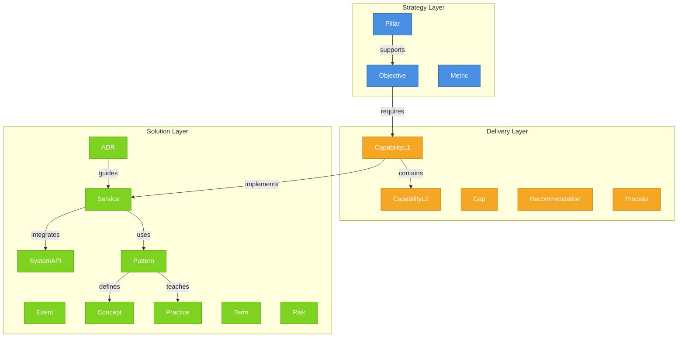

# Knowledge Ontology

## 3-Layer Architecture

## Entity Types by Layer

### Strategy Layer
- **Pillar**: Strategic pillar (Vision/Strategy layer)
- **Objective**: Measurable business objective
- **Metric**: Key performance indicator

### Delivery Layer
- **CapabilityL1**: Level 1 capability
- **CapabilityL2**: Level 2 capability
- **Gap**: Capability gap or deficiency
- **Recommendation**: Recommended action
- **Process**: Operational or technical process

### Solution Layer
- **ADR**: Architecture Decision Record
- **Service**: Software service
- **SystemAPI**: API or system interface
- **Event**: System event or trigger
- **Concept**: Principle or concept
- **Pattern**: Solution pattern
- **Practice**: Best practice
- **Term**: Glossary term
- **Risk**: Risk or threat

## Relation Types

- **supports_objective**: Supports an objective
- **requires_capability**: Requires a capability
- **requires_process**: Requires a process
- **implements_via_service**: Implemented via service
- **implemented_by_service**: Implemented by service
- **integrates_with**: Integrates with
- **references_concept**: References a concept
- **uses_pattern**: Uses a pattern
- **follows_practice**: Follows a practice
- **mitigates**: Mitigates a risk
- **measures**: Measures a metric

---

Generated: 2026-01-22
