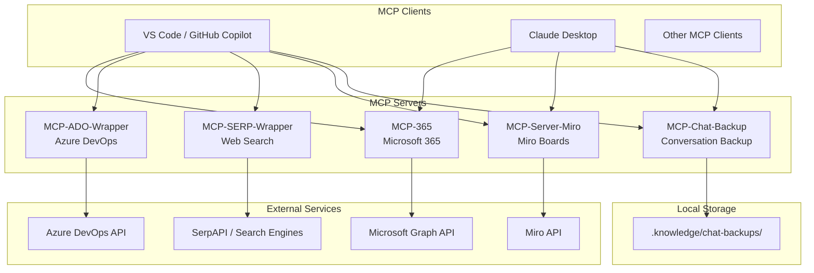

# MCP Tools Repository Knowledge Base

Documentation hub for all Model Context Protocol (MCP) servers in this repository.

## Overview

This repository contains 5 MCP servers providing AI agents (GitHub Copilot, Claude, etc.) with access to external services:

| Server | Purpose | Transport | Location |
|--------|---------|-----------|----------|
| [MCP-365](./mcp-365/README.md) | Microsoft 365 Graph API | stdio | `mcp-365/` |
| [MCP-ADO-Wrapper](./mcp-ado-wrapper/README.md) | Azure DevOps | stdio | `mcp-ado-wrapper/` |
| [MCP-SERP-Wrapper](./mcp-serp-wrapper/README.md) | Web Search (SerpAPI) | stdio | `mcp-serp-wrapper/` |
| [MCP-Server-Miro](./mcp-server-miro/README.md) | Miro Boards | SSE | `mcp-server-miro/` |
| [MCP-Chat-Backup](./mcp-chat-backup/README.md) | Chat Conversation Backup | stdio | `mcp-chat-backup/` |

## Architecture



## Quick Start

### VS Code Integration

Add to `.vscode/mcp.json`:

```jsonc
{
  "mcpServers": {
    "m365": {
      "type": "stdio",
      "command": "node",
      "args": ["c:/dev/mcp/mcp-365/src/index.js"]
    },
    "ado-wrapped": {
      "type": "stdio",
      "command": "node",
      "args": ["c:/dev/mcp/mcp-ado-wrapper/wrapper.js"]
    },
    "serp-wrapped": {
      "type": "stdio",
      "command": "node",
      "args": ["c:/dev/mcp/mcp-serp-wrapper/serp-wrapper.js"]
    }
  }
}
```

For MCP-Server-Miro (SSE transport):
1. Start server: `cd mcp-server-miro && npm start`
2. Connect MCP client to `http://localhost:8899/sse`

## Capability Matrix

| Capability | MCP-365 | MCP-ADO | MCP-SERP | MCP-Miro | MCP-Chat-Backup |
|------------|---------|---------|----------|----------|-----------------|
| Search | ✓ M365 content | ✓ Code/Wiki | ✓ Web/Images | ✗ | ✓ Chat history |
| Documents | ✓ SharePoint/OneDrive | ✓ Wiki pages | ✗ | ✗ | ✓ JSON/Markdown |
| Email/Calendar | ✓ Outlook | ✗ | ✗ | ✗ | ✗ |
| Work Items | ✗ | ✓ Full CRUD | ✗ | ✗ | ✗ |
| Pipelines | ✗ | ✓ Run/monitor | ✗ | ✗ | ✗ |
| Diagrams | ✗ | ✗ | ✗ | ✓ Mermaid export | ✗ |
| Visual Content | ✗ | ✗ | ✓ Images | ✓ Board items | ✗ |
| Chat Backup | ✗ | ✗ | ✗ | ✗ | ✓ Auto backup/import |

## MCP Memory Entities

All MCP servers are tracked in the knowledge graph:

- `MCP365Service` - Microsoft 365 integration
- `MCPADOWrapper` - Azure DevOps integration
- `MCPSerpWrapper` - Web search integration
- `MCPChatBackup` - Chat conversation backup/restore
- `MCPServerMiro` - Miro boards integration
- `MCPDynamicToolIntegration` - Common pattern for runtime tool discovery

## Related Documentation

- [VS Code MCP Documentation](https://code.visualstudio.com/docs/copilot/customization/mcp-servers)
- [GitHub MCP Registry](https://github.com/mcp)
- [MCP Specification](https://modelcontextprotocol.io/)
