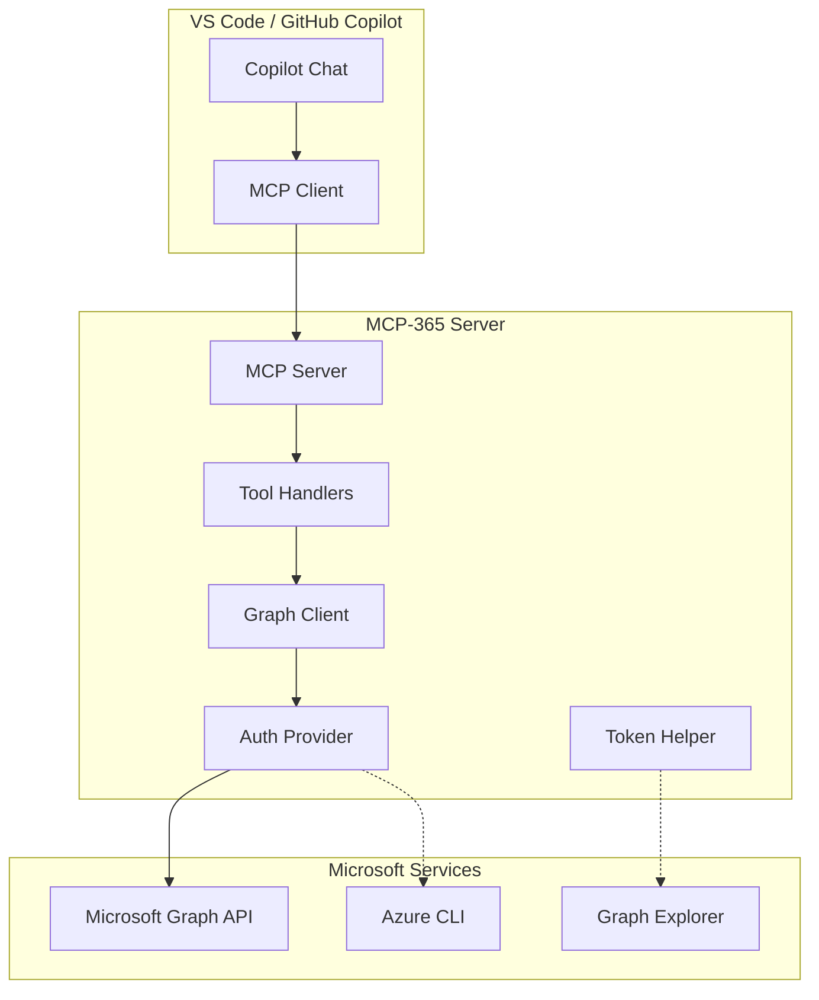
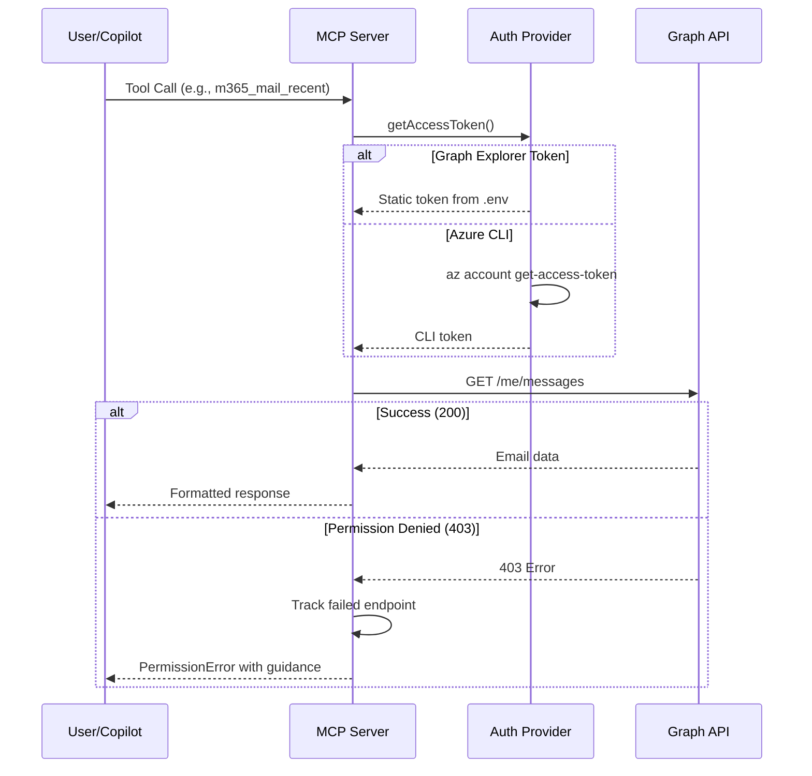

# MCP-365 Architecture

## System Overview



## Component Responsibilities

### MCP Server (src/index.js)
- Implements Model Context Protocol server using `@modelcontextprotocol/sdk`
- Registers 19 tools for M365 operations
- Handles tool call routing and response formatting

### Auth Provider (src/auth.js)
- Multi-strategy authentication with automatic fallback
- Priority: Graph Explorer Token → Azure CLI → Client Credentials → Device Code
- Caches tokens and handles refresh

### Graph Client (src/graph-client.js)
- Wraps Microsoft Graph API v1.0 and beta endpoints
- Implements capability detection for graceful degradation
- Tracks failed endpoints to avoid repeated permission errors
- Provides `PermissionError` class with resolution guidance

### Tool Handlers (src/tools/*.js)
- `search.js` - Unified M365 search, document search
- `sharepoint.js` - Sites, libraries, site content search
- `files.js` - OneDrive operations (list, read, metadata)
- `mail.js` - Email search and recent messages
- `calendar.js` - Events by date range, today, week views
- `teams.js` - Teams, channels, messages

### Token Helper (src/token-helper.js)
- Interactive CLI for Graph Explorer token management
- JWT decoding for status display (user, expiry, scopes)
- Auto-save to .env file

## Data Flow



## Configuration

### Environment Variables (.env)

```env
# App Registration (for custom app auth)
MICROSOFT_CLIENT_ID=your-app-id
MICROSOFT_TENANT_ID=your-tenant-id
MICROSOFT_CLIENT_SECRET=optional-secret

# Graph Explorer Token (recommended for enterprise)
MICROSOFT_ACCESS_TOKEN=your-token

# Scopes for device code flow
MICROSOFT_SCOPES=User.Read Mail.Read Calendars.Read Files.Read.All Sites.Read.All
```

### VS Code Integration (.vscode/mcp.json)

```json
{
  "servers": {
    "m365": {
      "type": "stdio",
      "command": "node",
      "args": ["C:/dev/mcp/mcp-365/src/index.js"]
    }
  }
}
```

## Technology Stack

| Component | Technology | Version |
|-----------|------------|---------|
| Runtime | Node.js | ≥18 |
| MCP SDK | @modelcontextprotocol/sdk | ^1.0.0 |
| Auth | @azure/msal-node | ^2.6.0 |
| Azure Identity | @azure/identity | ^4.2.0 |
| Config | dotenv | ^16.4.0 |

## Design Decisions

### Graceful Degradation
Rather than failing completely when permissions are missing, the system:
1. Tracks failed endpoints in memory
2. Returns helpful errors explaining required permissions
3. Provides `m365_status` tool to check capabilities upfront

### Multi-Strategy Authentication
Supports multiple auth methods because:
- Enterprise tenants often block custom app consent
- Azure CLI has limited Graph scopes
- Graph Explorer provides full access but requires manual refresh
- Different use cases need different auth flows

### Token Helper
Interactive CLI tool because:
- Graph Explorer tokens expire hourly
- Manual .env editing is error-prone
- JWT decoding provides visibility into token state
