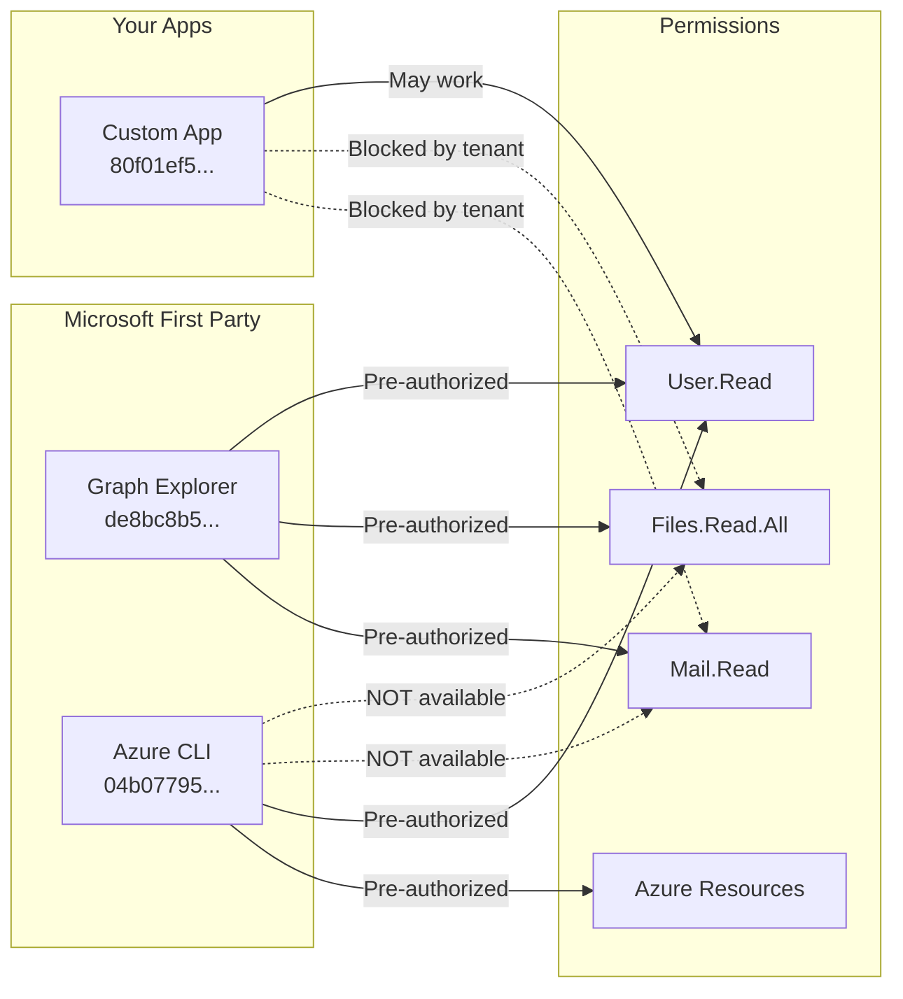

# MCP-365 Authentication

## Understanding Microsoft First-Party App Pre-Authorization

### The Core Problem

Enterprise tenants often have policies like:
> "Admin consent required for all apps not published by Microsoft"

This blocks custom app registrations from accessing Graph APIs, even for normally user-consentable permissions like `Mail.Read`.

### Why Graph Explorer Works (and Azure CLI Doesn't)



### Graph Explorer (de8bc8b5-d9f9-48b1-a8ad-b748da725064)

**Why it has full access:**
- Published by Microsoft and pre-verified in all tenants
- Pre-authorized for a wide range of Graph API permissions
- Uses **delegated permissions** (user consent only, no admin needed)
- When you consent to `Mail.Read`, you're saying "let Graph Explorer read MY mail as ME"

**Scopes available:**
- Mail.Read, Mail.ReadWrite
- Files.Read.All, Files.ReadWrite.All
- Calendars.Read, Calendars.ReadWrite
- Sites.Read.All, Sites.ReadWrite.All
- User.Read, User.ReadWrite.All
- Plus 30+ more Graph scopes

### Azure CLI (04b07795-8ddb-461a-bbee-02f9e1bf7b46)

**Why it has limited access:**
- Designed for Azure resource management (VMs, storage, networking)
- Has a **fixed scope set** configured by Microsoft
- Intentionally excludes personal data APIs
- Cannot request arbitrary Graph scopes

**Error when requesting custom scopes:**
```
AADSTS65002: Consent between first party application '04b07795...' 
and first party resource '00000003...' must be configured via preauthorization
```

**Scopes available:**
- User.Read, User.ReadWrite.All
- Group.ReadWrite.All
- Directory.AccessAsUser.All
- Application.ReadWrite.All
- Azure resource management scopes

**Scopes NOT available:**
- Mail.Read ❌
- Files.Read.All ❌
- Calendars.Read ❌
- Sites.Read.All (limited) ⚠️

### Custom App Registrations

**Why they may be blocked:**
- Not published/verified by Microsoft
- Tenant policy: "Admin consent required for all unverified apps"
- Even user-consentable permissions get blocked

**Resolution options:**
1. Request IT to grant admin consent
2. Verify/publish your app (complex process)
3. Use Graph Explorer token as workaround

## Authentication Strategies Comparison

| Strategy | Access Level | Auto-Refresh | Setup Effort | Best For |
|----------|--------------|--------------|--------------|----------|
| Graph Explorer Token | Full | ❌ (1hr expiry) | Low | Testing, development |
| Azure CLI | Limited | ✅ | None | User info, groups only |
| Custom App + Admin Consent | Full | ✅ | High | Production |
| Client Credentials | Full (app-only) | ✅ | High | Service accounts |

## Implementation Details

### Priority Order in auth.js

```javascript
export async function createAuthProvider(config) {
  // 1. Azure CLI (if no static token configured)
  if (config.useAzureCli !== false && !config.accessToken) {
    const azureCliProvider = await tryAzureCliProvider();
    if (azureCliProvider) return azureCliProvider;
  }

  // 2. Pre-configured access token (Graph Explorer)
  if (config.accessToken) {
    return { getAccessToken: () => config.accessToken, type: 'static' };
  }

  // 3. Client credentials (app-only)
  if (config.clientSecret) {
    // ... ConfidentialClientApplication
  }

  // 4. Device code flow (interactive)
  if (config.clientId) {
    // ... PublicClientApplication
  }
}
```

### Azure CLI Token Acquisition

```javascript
async function tryAzureCliProvider() {
  const { stdout } = await execAsync(
    'az account get-access-token --resource https://graph.microsoft.com --query accessToken -o tsv'
  );
  return {
    getAccessToken: async () => {
      const { stdout } = await execAsync('az account get-access-token ...');
      return stdout.trim();
    },
    type: 'azure_cli'
  };
}
```

### Token Helper Commands

```bash
# Check current token status
npm run token:status

# Output:
# === MCP-365 Token Status ===
# Status: ✓ Valid
# User: user@company.com
# App: Graph Explorer
# Expires: 1/19/2026, 11:57:17 AM
# Time left: 45 minutes
# Scopes (5):
#   ✓ Mail.Read
#   ✓ Files.Read
#   ✓ Sites.Read
#   ✓ Calendars.Read
#   ✓ User.Read

# Refresh token interactively
npm run token:refresh
```

## Troubleshooting

### "Access is denied. Check credentials and try again."

**Cause:** Token doesn't have required permission scope.

**Solution:**
1. Run `npm run token:status` to see current scopes
2. If missing needed scope, get new Graph Explorer token with that permission consented
3. Run `npm run token:refresh` and paste new token

### "AADSTS65002: Consent must be configured via preauthorization"

**Cause:** Azure CLI cannot request custom Graph scopes.

**Solution:**
1. Azure CLI has fixed scopes - this is by design
2. Use Graph Explorer token instead for Mail/Calendar/Files access

### "AADSTS50076: Application needs admin consent"

**Cause:** Enterprise tenant requires admin consent for unverified apps.

**Solution:**
1. Request IT to grant admin consent to your app registration
2. Or use Graph Explorer token as workaround
3. Or publish/verify your app (complex process)

### Token expired but npm run token:status shows valid

**Cause:** .env might have stale token, or clock skew.

**Solution:**
1. Get fresh token from Graph Explorer
2. Run `npm run token:refresh`
3. Verify system clock is accurate
