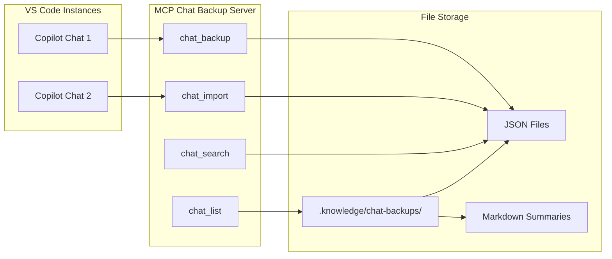

# MCP Chat Backup - Knowledge Documentation

## Overview

MCP Chat Backup is a Model Context Protocol server that enables **automated backup and restore of AI chat conversations**. It allows GitHub Copilot and other MCP clients to save conversation context to files and reload them in future sessions.

## Architecture



## Key Concepts

### Conversation Capture - Important Limitation

> ⚠️ **The AI cannot directly access raw conversation history.** The MCP tool wrapper does not pass conversation content to the backup tool.

When the user says "mcp chat backup", the tool provides:
1. A suggested filename and backup folder path
2. Instructions to export via VS Code (`Ctrl+Shift+P` → `Chat: Export Chat...`)
3. An alternative to use `chat_save_summary` for AI-generated summaries

### Two Backup Approaches

| Approach | Use When | Captures |
|----------|----------|----------|
| **VS Code Export** | Need full conversation history | Everything verbatim |
| **AI Summary** (`chat_save_summary`) | Need curated insights | Key decisions, code, takeaways |

### Backup Storage

Backups are organized by year/month:
```
.knowledge/chat-backups/
├── 2026/
│   └── 01/
│       ├── 2026-01-19-14-46-chat-backup.json
│       └── 2026-01-19-16-30-api-design.json
```

### Import for Context

The `chat_import` tool reads a backup file and returns formatted content that the AI can reference in the current conversation, enabling continuity across sessions.

## Tools

| Tool | Purpose | Input | Output |
|------|---------|-------|--------|
| `chat_backup` | Get backup path + instructions | `topic` | Folder path + VS Code export steps |
| `chat_import` | Load conversation | `filename` | Formatted chat content |
| `chat_list` | Browse backups | `limit` | List of available files |
| `chat_search` | Find by keyword | `keyword` | Matching files + previews |
| `chat_save_summary` | Save AI-generated summary | `topic`, `content` | Confirmation + filepath |

> 💡 **Recommended:** Use `chat_save_summary` when you want the AI to capture key insights, decisions, and code snippets from the conversation.

## Integration Points

### VS Code MCP Configuration

```json
{
  "chat-backup": {
    "type": "stdio",
    "command": "node",
    "args": ["C:\\dev\\mcp\\mcp-chat-backup\\server.js"],
    "env": {
      "CHAT_BACKUP_PATH": "C:\\dev\\mcp\\.knowledge\\chat-backups"
    }
  }
}
```

### Cross-Workspace Sharing

Multiple VS Code instances can share the same backup folder by:
1. Using the same `CHAT_BACKUP_PATH`
2. Syncing the folder via cloud storage (OneDrive, Dropbox)
3. Importing backups from other workspaces

## Usage Patterns

### Save AI Summary (Recommended)
End each significant chat session with:
```
mcp chat save summary topic:daily-standup
```
The AI will generate a markdown summary of key decisions, code, and insights.

### Full Conversation Export
For complete history, use VS Code's built-in export:
1. `Ctrl+Shift+P` → `Chat: Export Chat...`
2. Select JSON format
3. Save to the backup folder shown by `mcp chat backup`

### Research Continuity
Import previous research before continuing:
```
mcp chat import authentication-research
```

### Knowledge Search
Find relevant past conversations:
```
mcp chat search OAuth2
```

## Design Decisions

| Decision | Rationale |
|----------|-----------|
| VS Code export for full history | AI cannot access raw conversation; VS Code captures everything |
| AI summaries for key insights | AI can synthesize and highlight important exchanges |
| JSON format | Compatible with VS Code export, machine-readable |
| Year/month folder structure | Organized, prevents huge flat directories |
| Keyword search | Quick retrieval without external tools |
| Markdown summaries | Human-readable captures for key insights |

## Related Components

- **Storage**: [.knowledge/chat-backups/](../chat-backups/README.md)
- **MCP Registry**: [.vscode/mcp.json](../../.vscode/mcp.json)
- **Server Code**: [mcp-chat-backup/server.js](../../mcp-chat-backup/server.js)

## Maintenance

### Cleanup Old Backups
Periodically review and archive old backups:
```bash
# List backups older than 3 months
find .knowledge/chat-backups -name "*.json" -mtime +90
```

### Index Important Conversations
Move significant backups to `_indexed/` folder for long-term reference.
