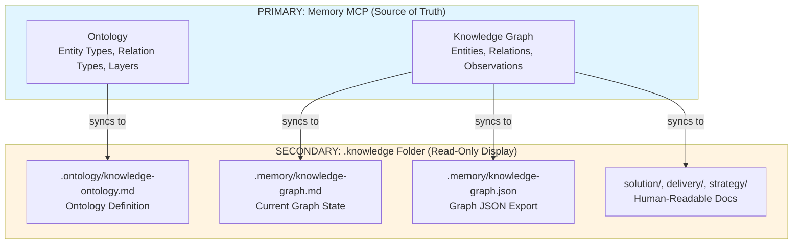

# MCP Knowledge Server

A Model Context Protocol (MCP) server that **enforces ontology on domain knowledge** by managing a knowledge graph synchronized with human-readable `.knowledge` folder documentation and memory MCP persistence.

## Mission

**Enforce an ontology (knowledge graph meta-model) on domain knowledge** stored in both structured (graph) and human-readable (markdown) forms. Manage a dedicated knowledge graph following strict ontology constraints while maintaining cross-session persistence and human-readable documentation.

## Overview

MCP Knowledge Server manages domain knowledge in **two complementary forms**:

1. **Structured Knowledge** (knowledge-graph.json) - Machine-readable, ontology-enforced entities and relations
2. **Human-Readable Knowledge** (.knowledge/ markdown files) - Synced documentation for human consumption

It provides AI agents (GitHub Copilot, Claude, etc.) with tools to:

**A. Enforce Ontology on Knowledge**
- Define startup ontology (standard or nomad foundations)
- Validate all entities/relations against ontology schema
- Ensure consistency across knowledge graph
- Track entity types across 3 architectural layers

**B. Manage Domain Knowledge Graph**
- Create/read/update entities with observations
- Define relationships between entities
- Search and query knowledge graph
- Export knowledge state

**C. Synchronize with Memory MCP (Required Prerequisite)**
- Persist knowledge across sessions via memory MCP tool
- Bi-directional synchronization (graph ↔ memory)
- Workspace-isolated knowledge storage
- Cross-session knowledge continuity

**D. Maintain Human-Readable Documentation**
- Auto-generate markdown from graph state
- Sync graph changes to `.knowledge` folder structure
- Generate diagrams (Mermaid) for visualization
- Version knowledge model via knowledge-index.json

## Prerequisites

**⚠️ REQUIRED: Memory MCP Tool**

This server **requires** the memory MCP tool to be configured for cross-session knowledge persistence. Configure in your VS Code `mcp.json`:

```json
{
  "mcpServers": {
    "memory": {
      "command": "npx",
      "args": ["-y", "@modelcontextprotocol/server-memory"],
      "env": {
        "MEMORY_STORAGE_PATH": "${workspaceFolder}/.knowledge/.memory"
      }
    },
    "knowledge": {
      "command": "node",
      "args": ["${workspaceFolder}/mcp-knowledge/server.js"]
    }
  }
}
```

**Why memory MCP is required:**
- Knowledge graph persists across Copilot sessions
- Workspace-isolated knowledge storage (per project)
- Bi-directional sync ensures graph + memory stay consistent
- Entity observations survive IDE restarts

**Without memory MCP configured, knowledge tools will not maintain state between sessions.**

## Features

- **🧠 Knowledge Graph Management**: CRUD operations on entities and relationships
- **📐 Ontology Enforcement**: Validate all entities/relations against 3-layer schema
- **📊 Visualization**: Generate Mermaid diagrams for ontology and model instances
- **🔄 Documentation Sync**: Auto-generate markdown docs from graph state
- **🧬 Memory MCP Sync** (Required): Persist knowledge across sessions
- **✅ Validation**: Strict ontology constraints on all graph operations
- **🔍 Search**: Find entities by name, type, or observations
- **📈 Statistics**: Detailed knowledge graph metrics by layer/type
- **� Versioning & Integrity**: SHA256 checksums, semantic versioning, tamper detection via `knowledge-index.json`

## Architecture

### Knowledge Graph Structure



**Architecture Principle:**
- **Memory MCP** = Single source of truth (ontology + knowledge graph)
- **.knowledge folder** = Read-only human representation synced FROM memory

### Storage Location

Knowledge follows a **strict hierarchy** with Memory MCP as the single source of truth:

**1. PRIMARY: Memory MCP Tool (Source of Truth)**
```
[Memory MCP Storage]
├── Ontology (entity types, relation types, 3 layers)
└── Knowledge Graph (entities, relations, observations)
```

**2. SECONDARY: .knowledge Folder (Read-Only Sync)**
```
.knowledge/
├── .memory/                               # Synced FROM memory (read-only)
│   ├── knowledge-graph.md                 # Current graph state (human-readable)
│   └── knowledge-graph.json               # Graph JSON export
├── .ontology/
│   └── knowledge-ontology.md              # Ontology definition (synced FROM memory)
├── {layer1}/                              # Layer folders (dynamic, based on ontology)
├── {layer2}/                              # e.g., solution/, delivery/, strategy/ (standard)
├── {layer3}/                              # or domain/, capability/, system/ (nomad)
├── knowledge-index.json                   # Versioning: Model evolution tracking
└── INDEX.md                               # Human-readable index
```

**Sync Flow:**
```
Memory MCP (ontology + graph) → .knowledge/.memory/ → .knowledge/{dynamic-layers}/
       ↓
   .ontology/knowledge-ontology.md (ontology definition)
       ↓
   .memory/knowledge-graph.md (current graph state)
       ↓
   .memory/knowledge-graph.json (JSON export)
       ↓
   {layer}/*.md (entity files, folders created dynamically)
```

**Key Principles:**
1. **Memory MCP** = Single source of truth for ontology AND knowledge graph
2. **.knowledge/.memory/** = Display files synced FROM memory (read-only)
3. **.knowledge/{dynamic-layers}/** = Human-readable docs FROM graph (folders adapt to ontology)
4. **Layers** are defined BY the ontology in memory (not hardcoded)

### Entity Type Hierarchy

**Layers Defined by Ontology in Memory:**

```
Strategy Layer:       Pillar → Objective → Metric
                        ↓
Delivery Layer:       CapabilityL1 → CapabilityL2 ← Gap, Recommendation, Risk, Process
                        ↓
Solution Layer:       ADR, Service, SystemAPI, Event
                      Concept, Pattern, Practice, Term
```

**Note:** The 3-layer structure (Strategy/Delivery/Solution) is defined by the ontology stored in Memory MCP, not hardcoded. Different ontologies (standard vs nomad) may define different layers or entity types.

**17 Entity Types Across 3 Layers (Standard Ontology):**

**Strategy Layer** (Vision & Goals)
- `Pillar`: Strategic pillar
- `Objective`: Measurable business objective  
- `Metric`: Key performance indicator

**Delivery Layer** (Execution & Governance)
- `CapabilityL1`: Level 1 capability (business)
- `CapabilityL2`: Level 2 capability (technical)
- `Gap`: Capability gap or deficiency
- `Recommendation`: Recommended action
- `Risk`: Identified risk or threat
- `Process`: Operational/technical process

**Solution Layer** (Architecture & Implementation)
- `ADR`: Architecture Decision Record
- `Service`: Software service
- `SystemAPI`: API or system interface
- `Event`: System event or trigger
- `Concept`: Core concept or principle
- `Pattern`: Reusable solution pattern
- `Practice`: Operational best practice
- `Term`: Glossary term or definition

### Relation Types (15 types)

**Strategic Relations:**
- `supports_objective`: Entity supports achieving objective
- `measures`: Metric measures capability or objective

**Execution Relations:**
- `mitigates`: Solution mitigates a risk
- `addresses`: Entity addresses a gap
- `requires`: Entity requires another entity

**Technical Relations:**
- `references_service`: Entity references a service
- `implements`: Entity implements pattern/concept
- `depends_on`: Entity depends on another
- `defines`: Entity defines term/concept
- `resolves`: Entity resolves risk/issue

**General Relations:**
- `related_to`: General relationship
- `uses`: Entity uses another
- `produces`: Entity produces output
- `consumes`: Entity consumes input
- `validates`: Entity validates another

## Tools

### Initialization

#### knowledge_init
Initialize new knowledge base with ontology selection.

**Parameters:**
- `targetPath` (required): Path where to create .knowledge folder
- `projectName` (optional): Project name for documentation
- `ontology` (optional): 'standard' | 'nomad' (default: standard)

**Creates:**
- Memory MCP entities for selected ontology (entity types, relation types, layers)
- `.knowledge/` folder structure
- `.memory/knowledge-graph.md` (initial empty graph)
- `.memory/knowledge-graph.json` (initial empty graph)
- `.ontology/knowledge-ontology.md` (synced FROM memory)
- `knowledge-index.json` v1.0.0

**Workflow:**
1. Load selected ontology (standard/nomad) into Memory MCP
2. Create .knowledge folder structure
3. Sync ontology FROM memory to .ontology/knowledge-ontology.md
4. Initialize knowledge-index.json

**Example:**
```javascript
{
  "targetPath": "./my-project",
  "projectName": "MyProject",
  "ontology": "standard"
}
```

### Knowledge Graph Management

#### knowledge_graph_read
Read the complete knowledge graph or filter by entity type.

**Parameters:**
- `filter` (optional): Filter by entity type (e.g., "Service", "ADR")
- `includeRelations` (optional): Include relations in output (default: true)

**Returns:** Complete graph with entities, relations, and metadata

#### knowledge_graph_add_entity
Add new entity to knowledge graph with ontology validation.

**Parameters:**
- `name` (required): Entity name (PascalCase, unique)
- `type` (required): Entity type from ontology
- `observations` (optional): Array of observation strings

**Example:**
```javascript
{
  "name": "AuthenticationService",
  "type": "Service",
  "observations": [
    "Handles OAuth2 flow",
    "Supports SAML integration"
  ]
}
```

#### knowledge_graph_add_relation
Add relationship between two entities with validation.

**Parameters:**
- `from` (required): Source entity name
- `to` (required): Target entity name
- `type` (required): Relation type (e.g., supports_objective, mitigates, references_service)

**Example:**
```javascript
{
  "from": "AuthenticationService",
  "to": "SecurityRisk",
  "type": "mitigates"
}
```

#### knowledge_graph_export
Export knowledge graph as JSON (JSON/YAML coming).

**Parameters:**
- `includeOntology` (optional): Include ontology definition (default: true)

#### knowledge_graph_search
Search entities by name, type, or observations.

**Parameters:**
- `query` (required): Search term
- `searchType` (optional): 'name' | 'type' | 'observations' | 'all' (default: all)

**Example:**
```javascript
{
  "query": "authentication",
  "searchType": "observations"
}
```

#### knowledge_graph_stats
Get statistics about knowledge graph.

**Parameters:**
- `detailed` (optional): Include detailed breakdown (default: false)

**Returns:**
```json
{
  "totalEntities": 15,
  "totalRelations": 22,
  "ontology": {
    "entityTypes": 17,
    "relationTypes": 11
  },
  "categories": {
    "Service": 3,
    "ADR": 2,
    ...
  }
}
```

### Ontology Management

#### knowledge_ontology_view
Display knowledge ontology with all entity and relation types.

**Parameters:**
- `format` (optional): 'table' | 'markdown' (default: table)

**Returns:** Ontology definition grouped by layer

#### knowledge_ontology_extend
Add new entity type or relation type to the ontology.

**Parameters:**
- `itemType` (required): 'entityType' | 'relationType'
- `name` (required): Name of new type
- `description` (required): Description
- `layer` (optional): For entity types: 'strategy' | 'delivery' | 'solution'

**Example:**
```javascript
{
  "itemType": "entityType",
  "name": "Stakeholder",
  "description": "Key stakeholder in the domain",
  "layer": "strategy"
}
```

#### knowledge_graph_validate
Validate knowledge graph against ontology schema.

**Parameters:**
- `mode` (optional): 'entities' | 'relations' | 'all' (default: all)

**Returns:**
```json
{
  "valid": true,
  "errors": [],
  "warnings": [],
  "summary": "Found 0 errors, 0 warnings"
}
```

### Synchronization (Memory MCP Required)

#### knowledge_sync_memory
Synchronize knowledge graph with memory MCP tool for persistence.

**⚠️ Requires memory MCP tool configured (see Prerequisites)**

**Parameters:**
- `action` (required): 'to_memory' | 'from_memory' | 'bidirectional'
- `includeMetadata` (optional): Include metadata in sync (default: true)

**Workflow:**
- `to_memory`: Push graph entities → memory MCP (backup current state)
- `from_memory`: Pull memory entities → graph (restore from memory)
- `bidirectional`: Keep graph ↔ memory in sync

**Example:**
```javascript
{
  "action": "bidirectional",
  "includeMetadata": true
}
```

#### knowledge_docs_sync
Bidirectional synchronization between memory and .knowledge folder content.

**Parameters:**
- `action` (required): 'to_docs' | 'from_docs'
- `generateDiagrams` (optional): Generate Mermaid diagrams (default: true)

**Workflow:**

**`to_docs`: Memory → .knowledge folder (Generate documentation)**
1. Syncs ontology definition to `.ontology/knowledge-ontology.md`
2. Syncs graph state to `.memory/knowledge-graph.md` and `.memory/knowledge-graph.json`
3. **Dynamically extracts layers from ontology** (e.g., strategy, delivery, solution)
4. **Traverses memory entities** and generates markdown files:
   - Each entity → `{layer}/*.md` (based on entity type's layer definition)
   - Folder structure adapts to ontology (standard vs nomad vs custom)
5. **Updates knowledge-index.json** with new entries
6. **Auto-calls knowledge_update_index** to compute checksums and bump version

**Generated File Format:**
```markdown
---
entityType: Service
relations:
  - supports_objective: ScalabilityObjective
  - references_service: DatabaseService
---

# AuthenticationService

**Type:** Service

## Observations

- Handles OAuth2 flow
- Supports SAML integration

## Relations

- supports_objective: ScalabilityObjective
- references_service: DatabaseService
```

**`from_docs`: .knowledge folder → Memory (Import from documentation)**
1. **Dynamically extracts layers from ontology** to determine which folders to scan
2. Scans each layer folder (e.g., `solution/`, `delivery/`, `strategy/`) for `.md` files
3. Parses front-matter to extract `entityType` and `relations`
4. Extracts observations from `## Observations` section
5. **Creates or updates entities** in memory graph
6. **Creates relations** from front-matter metadata
7. Aligns with **knowledge-index.json** entries

**Note:** Folder structure is determined by the active ontology. Standard ontology uses `strategy/`, `delivery/`, `solution/`. Nomad ontology may use different layers. Custom ontologies define their own layer structure.

**Returns (to_docs):**
```json
{
  "success": true,
  "action": "to_docs",
  "files": {
    "ontology": ".knowledge/.ontology/knowledge-ontology.md",
    "graph": ".knowledge/.memory/knowledge-graph.md",
    "generated": 15
  },
  "generatedFiles": [
    "solution/authentication-service.md",
    "delivery/api-capability-l2.md",
    "strategy/scalability-objective.md"
  ],
  "indexUpdate": {
    "updated": true,
    "version": { "before": "2.0.1", "after": "2.0.2" }
  },
  "note": "Folders dynamically created based on ontology layers"
}
```

**Returns (from_docs):**
```json
{
  "success": true,
  "action": "from_docs",
  "summary": {
    "entitiesAdded": 12,
    "relationsAdded": 18,
    "errors": 0
  },
  "entities": ["AuthenticationService", "APICapabilityL2", ...],
  "relations": ["AuthenticationService_supports_objective_ScalabilityObjective", ...]
}
```

**Example:**
```javascript
// Export memory to documentation
{
  "action": "to_docs",
  "generateDiagrams": true
}

// Import documentation to memory
{
  "action": "from_docs"
}
```

### Visualization

#### knowledge_model_visualize
Generate Mermaid diagrams for ontology or model instances.

**Parameters:**
- `type` (required): 'ontology' | 'model'
  - `ontology`: 3-layer entity type architecture
  - `model`: Current knowledge graph instances

**Returns:** Mermaid diagram definition

**Example:**
```javascript
{
  "type": "ontology"
}
```

### Versioning & Integrity

#### knowledge_update_index
Update `knowledge-index.json` with SHA256 checksums and version tracking.

**Purpose:** Maintain document integrity and version control across the entire `.knowledge` folder with automated checksum computation and metadata enrichment.

**Parameters:**
- `generateReports` (optional): Generate integrity reports and INDEX.md (default: true)

**Workflow:**
1. Scans all entries in `knowledge-index.json`
2. Computes SHA256 checksums for each document
3. Parses front-matter to extract `entityType` and `relations`
4. Updates missing or placeholder checksums
5. Bumps semantic version (patch increment)
6. Generates `integrity-report.md` (missing metadata, orphan detection)
7. Generates `INDEX.md` (human-readable index grouped by category)

**Auto-Execution:**
- Automatically called after `knowledge_docs_sync` completes
- Ensures checksums stay current with every documentation sync
- Version is incremented only when changes are detected

**Returns:**
```json
{
  "success": true,
  "updated": true,
  "version": {
    "before": "2.0.1",
    "after": "2.0.2"
  },
  "entries_processed": 29,
  "reports_generated": ["integrity-report.md", "INDEX.md"]
}
```

**knowledge-index.json Structure:**
```json
{
  "version": "2.0.2",
  "generated": "2026-01-24",
  "schema": {
    "entry": {
      "slug": "string",
      "path": "string (relative to .knowledge/)",
      "checksum": "sha256 hex string (64 chars)",
      "entityType": "string (from front-matter)",
      "relations": ["array of relation strings"]
    }
  },
  "entries": [
    {
      "slug": "glossary",
      "path": "solution/glossary.md",
      "title": "Glossary",
      "category": "Reference",
      "checksum": "93269432b789579dab74dbdaeb62916f8c78db211b83c6511ceb364275a35032",
      "entityType": "Concept",
      "relations": ["defines: knowledge-model"]
    }
  ]
}
```

**Integrity Reports:**
- `integrity-report.md`: Lists entries missing metadata (entityType, relations), potential orphans
- `INDEX.md`: Human-readable navigation grouped by category, sorted alphabetically

**Version Semantics:**
- **Patch increment (2.0.1 → 2.0.2)**: Checksums updated, metadata enriched, no structural changes
- **Minor increment (2.0.0 → 2.1.0)**: New entries added, categories changed (manual bump)
- **Major increment (2.0.0 → 3.0.0)**: Schema changes, breaking restructure (manual bump)

**Security Benefits:**
- **Tamper detection**: SHA256 checksums detect unauthorized modifications
- **Integrity verification**: Compare checksums to detect corrupted files
- **Audit trail**: Version history tracks when documents were last verified
- **Quality assurance**: Reports flag missing metadata before it becomes a problem

**Example Usage:**
```javascript
// Manual index update
{
  "name": "knowledge_update_index",
  "arguments": {
    "generateReports": true
  }
}

// Automatic (via sync)
{
  "name": "knowledge_docs_sync",
  "arguments": {
    "action": "to_docs"
  }
}
// → Automatically calls knowledge_update_index
```

## Versioning (knowledge-index.json)

The `knowledge-index.json` file tracks model evolution and change history:

```json
{
  "version": "1.2.3",
  "created": "2026-01-22T10:00:00Z",
  "lastUpdated": "2026-01-23T14:30:00Z",
  "projectName": "MyProject",
  "ontologyType": "standard",
  "changeHistory": [
    {
      "version": "1.2.3",
      "date": "2026-01-23T14:30:00Z",
      "changes": "Added 5 Service entities, 3 ADRs",
      "entityCount": 42,
      "relationCount": 67
    },
    {
      "version": "1.2.2",
      "date": "2026-01-23T10:00:00Z",
      "changes": "Extended ontology with Risk entities",
      "entityCount": 37,
      "relationCount": 64
    }
  ],
  "statistics": {
    "totalEntities": 42,
    "totalRelations": 67,
    "entitiesByType": {
      "Service": 12,
      "ADR": 8,
      "Risk": 5
    }
  }
}
```

**Version Increment Rules:**
- **Major (x.0.0)**: Ontology breaking changes (entity/relation type removed)
- **Minor (1.x.0)**: Ontology extensions (new entity/relation types added)
- **Patch (1.2.x)**: Entity/relation additions without ontology changes

**Automatic Updates:**
- Created on `knowledge_init`
- Updated on `knowledge_graph_add_entity` (increments patch)
- Updated on `knowledge_ontology_extend` (increments minor)
- Change history limited to last 50 entries

## Usage Examples

### Initialize and Populate Graph

```javascript
// 1. Initialize with standard ontology
{
  "name": "knowledge_init",
  "arguments": {
    "targetPath": "./my-project",
    "projectName": "MyProject",
    "ontology": "standard"
  }
}

// 2. Add entities
{
  "name": "knowledge_graph_add_entity",
  "arguments": {
    "name": "MicroservicesArch",
    "type": "ADR",
    "observations": ["Decided to use microservices pattern", "Date: 2026-01-22"]
  }
}

// 3. Add relation
{
  "name": "knowledge_graph_add_relation",
  "arguments": {
    "from": "MicroservicesArch",
    "to": "ScalabilityObjective",
    "type": "supports_objective"
  }
}

// 4. Sync to memory (persist across sessions)
{
  "name": "knowledge_sync_memory",
  "arguments": {
    "action": "to_memory"
  }
}

// 5. Generate documentation
{
  "name": "knowledge_docs_sync",
  "arguments": {
    "action": "to_docs",
    "generateDiagrams": true
  }
}
```

### Search and Query

```javascript
// Find all services
{
  "name": "knowledge_graph_search",
  "arguments": {
    "query": "Service",
    "searchType": "type"
  }
}

// Find entities about authentication
{
  "name": "knowledge_graph_search",
  "arguments": {
    "query": "authentication",
    "searchType": "observations"
  }
}

// Get graph statistics
{
  "name": "knowledge_graph_stats",
  "arguments": {
    "detailed": true
  }
}
```

## Natural Language Integration

When using with GitHub Copilot or Claude:

**Discovery Queries:**
- "Show me the knowledge graph structure" → `knowledge_graph_stats`
- "What entities exist of type Service?" → `knowledge_graph_read` with filter
- "Display the ontology" → `knowledge_ontology_view`
- "Search for entities about authentication" → `knowledge_graph_search`

**Management Queries:**
- "Add a new Service called AuthAPI" → `knowledge_graph_add_entity`
- "Create a relation: AuthAPI references-service UserDB" → `knowledge_graph_add_relation`
- "Validate the knowledge graph" → `knowledge_graph_validate`

**Visualization Queries:**
- "Generate a diagram of the knowledge ontology" → `knowledge_model_visualize` type=ontology
- "Show me the current model instances as a diagram" → `knowledge_model_visualize` type=model
- "Sync the graph to documentation" → `knowledge_docs_sync` action=to_docs

**Memory Integration:**
- "Sync this graph with memory for persistence" → `knowledge_sync_memory` action=to_memory
- "Load entities from memory MCP" → `knowledge_sync_memory` action=from_memory

## Workflow Examples

### 1. Architectural Decision Capture

```
1. Create ADR entity: knowledge_graph_add_entity
   - Name: "MultiTenantArchitecture"
   - Type: "ADR"
   - Observations: ["Enables scalability", "Requires data isolation"]

2. Add related entities:
   - Create "DataIsolationRisk" (Risk)
   - Create "MultiTenancyPattern" (Pattern)

3. Connect them:
   - ADR → addresses → DataIsolationRisk
   - ADR → implements → MultiTenancyPattern

4. Sync to docs: knowledge_docs_sync action=to_docs
   - Generates knowledge-model.md with Mermaid diagram
```

### 2. Capability Gap Analysis

```
1. List capabilities: knowledge_graph_read filter=CapabilityL1

2. Add gaps: knowledge_graph_add_entity
   - For each missing capability
   - Type: "Gap"

3. Add recommendations: knowledge_graph_add_entity
   - Type: "Recommendation"
   - Connect: Recommendation → addresses → Gap

4. Generate report: knowledge_model_visualize type=model
   - Visualize gaps and recommendations
```

### 3. Knowledge Graph Maintenance

```
1. CGraph file not found
- Verify `.knowledge/solution/taxonomy/` directory exists
- Run any graph operation to auto-initialize
- Check `KNOWLEDGE_PATH` environment variable

### Ontology validation errors
- Ensure entity types are spelled exactly (PascalCase)
- Ensure relation types use snake_case
- Check `knowledge_ontology_view` to see valid types

### Memory sync not working
- Verify memory MCP tool is available
- Check that memory tool is configured in mcp.json
- Use `knowledge_sync_memory` to debug connection

### Diagram generation issues
- Ensure Mermaid syntax is correct
- Validate entities with `knowledge_graph_validate`
- Check entity names don't contain special characters

## Development

### Running locally
```bash
cd mcp-knowledge
npm install
node server.js
```

### Testing with MCP Inspector
```bash
npx @modelcontextprotocol/inspector node server.js
```

### Debug mode
```bash
DEBUG=mcp-knowledge node server.js
```

### File Structure After Operations

After using `knowledge_docs_sync action=to_docs`:

```
.knowledge/
├── .memory/                      # FROM Memory MCP (read-only display)
│   ├── knowledge-graph.md        # Current graph state (replaces knowledge-model.md)
│   └── knowledge-graph.json      # JSON export (read-only)
├── .ontology/
│   └── knowledge-ontology.md     # FROM Memory: entity/relation types
├── solution/                     # Human-readable solution docs
├── delivery/                     # Human-readable delivery docs
├── strategy/                     # Human-readable strategy docs
├── knowledge-index.json          # Versioning: change history
└── INDEX.md                      # Human-readable index
```

**File Purposes:**
- `.memory/knowledge-graph.md`: Current knowledge graph FROM memory (read-only)
- `.memory/knowledge-graph.json`: JSON export FROM memory (read-only)
- `.ontology/knowledge-ontology.md`: Ontology definition FROM memory (read-only)
- `knowledge-index.json`: Version tracking (managed by tool)
- `solution/delivery/strategy/`: Human-readable docs generated FROM graph

## Troubleshooting

### Memory MCP not configured
**Error:** "Memory MCP tool not available" or state not persisting

**Solution:** 
1. Add memory MCP to your `mcp.json` (see Prerequisites)
2. Restart VS Code
3. Test with `knowledge_sync_memory action=to_memory`
4. Verify `.knowledge/.memory/` folder is created

### Graph file not found
**Error:** "knowledge-graph.json not found"

**Solution:**
1. Verify `.knowledge/` directory exists
2. Run `knowledge_init` to create new knowledge base
3. Check `KNOWLEDGE_PATH` environment variable

### Ontology validation errors
**Error:** "Invalid entity type" or "Invalid relation type"

**Solution:**
1. Ensure entity types are PascalCase (e.g., `Service`, not `service`)
2. Ensure relation types use snake_case (e.g., `supports_objective`)
3. Check valid types with `knowledge_ontology_view`
4. Verify type exists in current ontology (standard or nomad)

### Diagram generation issues
**Error:** Mermaid diagram not rendering

**Solution:**
1. Validate entities with `knowledge_graph_validate`
2. Check entity names don't contain special characters
3. Ensure relations reference existing entities
4. Use `knowledge_model_visualize` to test diagram generation

### Version sync issues
**Error:** "knowledge-index.json version mismatch"

**Solution:**
1. Check if knowledge-index.json exists
2. Verify version format is semver (1.2.3)
3. Use `knowledge_graph_stats` to see current state
4. Manually update version if needed

## Performance

- **Graph Operations**: O(1) for entity access, O(n) for search
- **Validation**: O(n×m) where n=entities, m=relation types
- **Visualization**: Generates Mermaid on-demand, no caching
- **Scalability**: Tested with 1000+ entities

**Optimization Tips:**
- Use filters in `knowledge_graph_read` to reduce data
- Batch entity additions to reduce file I/O
- Cache diagram generation in your application
- Use search with specific searchType to narrow results

## Roadmap

Planned enhancements:

- [x] Memory MCP integration for cross-session persistence
- [x] Ontology validation and enforcement
- [x] Mermaid diagram generation
- [ ] **knowledge-index.json auto-versioning** (implementation in progress)
- [ ] YAML export format
- [ ] Bulk import from CSV/JSON
- [ ] Graph querying language (GraphQL-like)
- [ ] Relation weighting and strength metrics
- [ ] Automatic duplicate detection
- [ ] Integration with git history for change tracking
- [ ] Diff/merge support for collaboration
- [ ] Custom diagram templates
- [ ] Export to Excalidraw/Miro format
- [ ] Full bidirectional docs_sync (from_docs parsing)

## License

MIT

## Related Tools

- [MCP Memory](https://github.com/modelcontextprotocol/servers) - **Required prerequisite** for knowledge persistence
- [MCP Chat Backup](../mcp-chat-backup/README.md) - Backup Copilot chat sessions
- [MCP-365](../mcp-365/README.md) - Microsoft 365 integration
- [MCP-ADO-Wrapper](../mcp-ado-wrapper/README.md) - Azure DevOps integration

## See Also

- [MCP Protocol Specification](https://modelcontextprotocol.io)
- [MCP SDK Documentation](https://github.com/modelcontextprotocol/sdk)
- [Documentation Standards](../.github/copilot-instructions.md)
- [Knowledge Ontology Schema](SCHEMA.md)
- [Quick Start Guide](QUICKSTART.md)
- [Nomad Ontology](NOMAD_ONTOLOGY_FOUNDATION.md)

## Support

For issues, questions, or contributions:

1. **Verify Prerequisites**: Ensure memory MCP tool is configured correctly
2. **Check Documentation**: Review troubleshooting section above
3. **Test Tools**: Use `knowledge_graph_stats` to verify graph health
4. **Validate**: Use `knowledge_graph_validate` to check consistency
5. **Enable Debugging**: Set `DEBUG=mcp-knowledge` for detailed logs

**Common Questions:**
- **"Why is memory MCP required?"** - Memory MCP IS the knowledge graph. Everything else is just human-readable display synced FROM memory.
- **"What's the primary source of truth?"** - Memory MCP stores both ontology AND knowledge graph. .knowledge folder is read-only display.
- **"What's the difference between .memory/knowledge-graph.json and .memory/knowledge-graph.md?"** - Same content, different formats: JSON (machine-readable) vs Markdown (human-readable). Both synced FROM memory.
- **"Can I edit .memory/ files directly?"** - No. These are read-only displays synced FROM Memory MCP. Use knowledge_graph_* tools to modify, then sync with knowledge_docs_sync.
- **"What defines the layers (Strategy/Delivery/Solution)?"** - The ontology stored in Memory MCP. Different ontologies (standard vs nomad) may define different layers.
- **"How do I version my knowledge model?"** - knowledge-index.json tracks versions automatically (implementation in progress).
{
  "name": "knowledge_graph_search",
  "arguments": {
    "query": "Service",
    "searchType": "type"
  }
}

// Find entities related to authentication
{
  "name": "knowledge_graph_search",
  "arguments": {
    "query": "authentication",
    "searchType": "observations"
  }
}d): 'to_memory' | 'from_memory' | 'bidirectional'
- `includeMetadata` (optional): Include metadata in sync (default: true)

**Note:** Requires memory MCP tool to be available

**Workflow:**
```
Graph → Memory: Convert entities to memory entities
Memory → Graph: Extract entities from memory
Bidirectional: Keep both in sync **General**: Basic markdown with title and date

### knowledge_update

Update an existing document in .knowledge folder.

**Parameters:**
- `path` (required): Relative path to document
- `content` (required): New content or content to append
- `append` (optional): Append to existing content (default: false)
- `basePath` (optional): Custom base path

**Example:**
```javascript
{
  "path": "concepts/existing-feature.md",
  "content": "\n## New Section\n\nAdditional information...",
  "append": true
}
```

### knowledge_structure

Get folder structure overview as a tree.

**Parameters:**
- `basePath` (optional): Custom base path
- `subPath` (optional): Show structure of specific subfolder

**Example:**
```javascript
{
  "subPath": "mcp-365"
}
```

### knowledge_index

Get comprehensive knowledge base index with categorized files.

**Parameters:**
- `basePath` (optional): Custom base path

**Returns:**
```json
{
  "totalFiles": 42,
  "totalSize": 524288,
  "categories": {
    "concepts": [...],
    "patterns": [...],
    "practices": [...],
    "decisions": [...],
    "tools": [...],
    "projects": [...],
    "other": [...]
  },
  "lastGenerated": "2026-01-22T..."
}
```

## Knowledge Management Principles

This server enforces documentation standards from `.github/copilot-instructions.md`:

### Knowledge Hierarchy (Top to Bottom)

**1. Memory MCP (PRIMARY - Source of Truth)**
- Ontology: Entity types, relation types, 3 layers defined here
- Knowledge Graph: All entities, relations, observations stored here

**2. .knowledge Folder (SECONDARY - Read-Only Display)**
- `.ontology/knowledge-ontology.md`: Ontology definition synced FROM memory
- `.memory/knowledge-graph.md`: Current graph state synced FROM memory  
- `.memory/knowledge-graph.json`: JSON export synced FROM memory
- `solution/delivery/strategy/`: Human-readable docs generated FROM graph

### Knowledge as Two Forms (Both FROM Memory)

**Structured Knowledge** (.memory/knowledge-graph.json):
- Synced FROM memory MCP (read-only)
- Entities with PascalCase names
- Relations with snake_case types
- Observations as structured facts
- JSON format for machine processing

**Human-Readable Knowledge** (.knowledge/ markdown):
- Synced FROM memory MCP via structured knowledge
- `.ontology/knowledge-ontology.md`: Ontology with entity/relation type definitions
- `.memory/knowledge-graph.md`: Current graph with all entities and relations (replaces old knowledge-model.md)
- `solution/delivery/strategy/*.md`: Dedicated pages for specific entities
- Mermaid diagrams for visualization

### Writing Standards for Observations

When adding observations to entities:
- Use plain, concise language
- Define jargon on first use
- Include rationale for decisions
- Document rejected alternatives
- Use present tense for facts
- Use imperative for actions

### Markdown Generation

The `knowledge_docs_sync` tool generates markdown following these templates:

**Ontology Documentation** (.ontology/knowledge-ontology.md):
- Synced FROM Memory MCP ontology
- Entity types grouped by layer (Strategy/Delivery/Solution)
- Relation types with descriptions
- Examples for each type
- Read-only display of ontology in memory

**Graph State Documentation** (.memory/knowledge-graph.md):
- Synced FROM Memory MCP knowledge graph
- Statistics and breakdown by type/layer
- All entities with observations
- Relations list with source → target
- Mermaid diagrams (optional)
- Replaces old knowledge-model.md

**JSON Export** (.memory/knowledge-graph.json):
- Synced FROM Memory MCP knowledge graph
- Complete graph data structure
- Machine-readable format
- Read-only display

## Development

### Running locally
```bash
node server.js
```

### Testing with MCP Inspector
```bash
npx @modelcontextprotocol/inspector node server.js
```

## License

MIT

## Related Tools

- [MCP Chat Backup](../mcp-chat-backup/README.md) - Backup Copilot chat sessions
- [MCP Memory](https://github.com/modelcontextprotocol/servers) - Knowledge graph memory

## See Also

- [MCP Documentation](https://modelcontextprotocol.io)
- [Documentation Standards](.github/copilot-instructions.md)
- [Knowledge Base Overview](../.knowledge/README.md)
